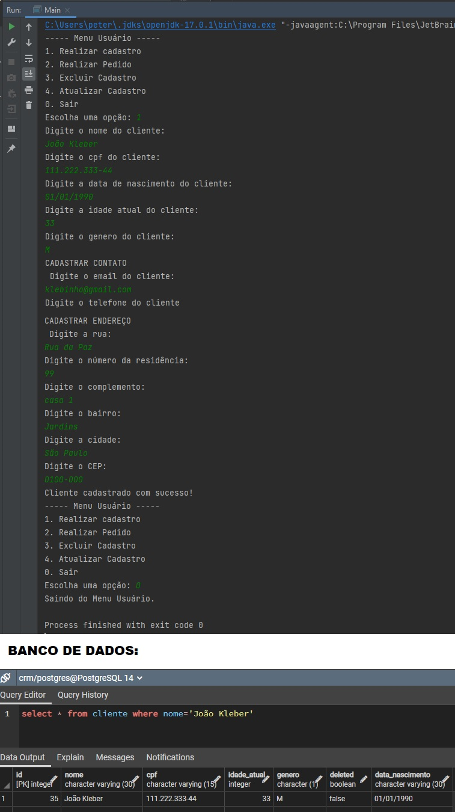

# Projeto-CRM-Desktop

## Desafio de projeto Ultima School

**Desafio:**
- Com base na atividade da semana 4, crie as classes de Repositórios para as tabelas restantes. São elas: Produto, Entrega, Cliente, Pedido, Pedido_produto.
- Utilizando os conceitos de arquitetura limpa (principalmente a camada de serviço), criar as lógicas de negócio para cadastrar um cliente, um pedido, adicionar produtos de pedido e a entrega do produto.
- Considere como regras:
  - Não pode existir mais de um cliente com o mesmo CPF ou email.
  - Não pode existir mais de um Produto com o mesmo nome.
  - A Entrega deve possuir a data em que o produto foi entregue ao cliente e, se possuir essa data, deve também possuir o nome da pessoa que recebeu.
  - O valor total do pedido deve ser calculado com base no valor individual dos produtos que fazem parte do pedido e a quantidade de cada produto.
    - Exemplo: Se um produto custa R$ 10,90 e um pedido possui dois desse produto, o valor total do pedido seria 2 x R$ 10,90, ou seja, R$ 21,80.
  - Todos os deletes devem ser lógicos, ou seja, os dados não devem ser deletados fisicamente do banco de dados.
    - Dica: Revisar conteúdo da semana 3 deste módulo.
  - O Status do pedido deve ser atualizado de acordo com o status da entrega.
    - Exemplo: Se a entrega possui estado “Entregue”, o estado do pedido deve ser atualizado para “Finalizado”.
  - A data de criação do pedido deve ser definida.

Cadastrar Cliente:

